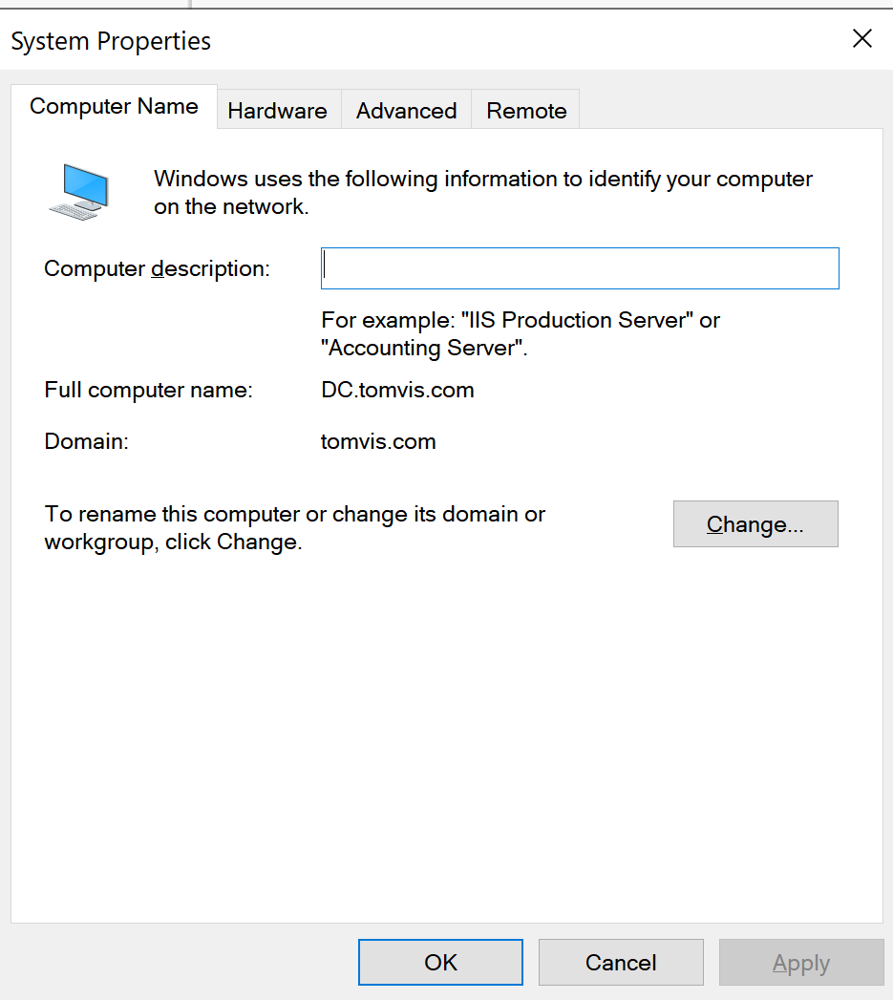
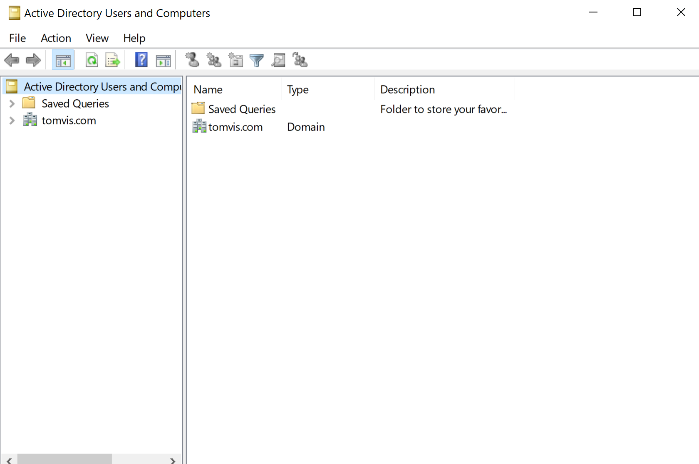
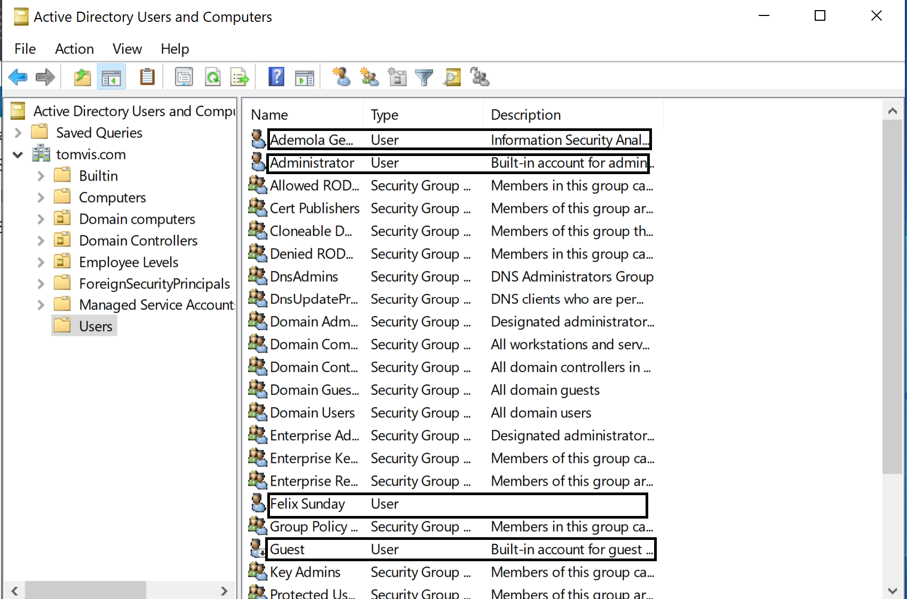
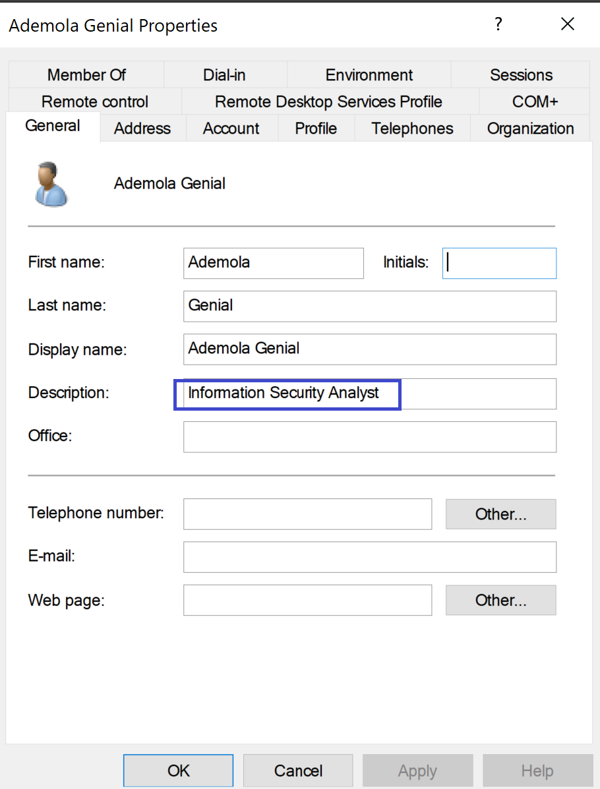
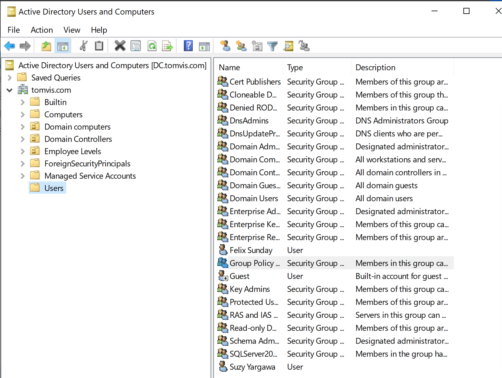
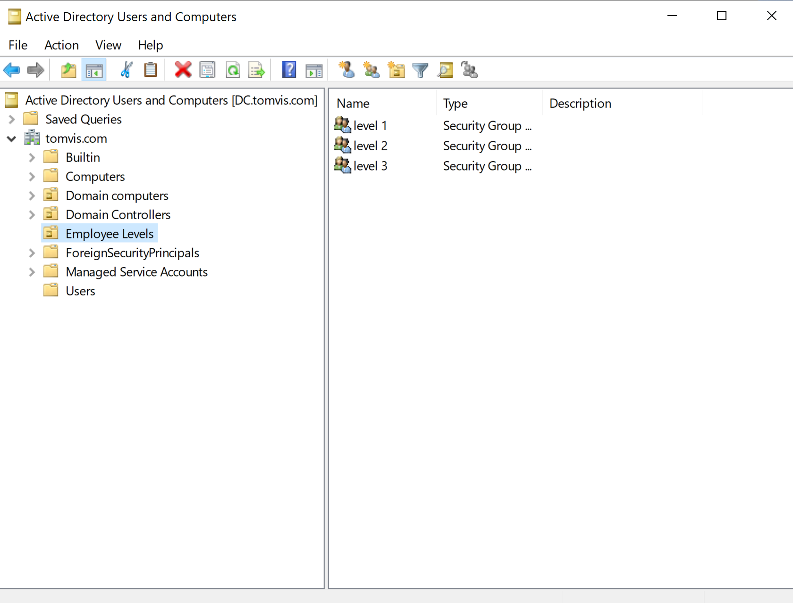

# Active Directory Security Lab

## Overview
This project demonstrates the design, deployment, and security hardening of an on-premises Active Directory (AD) environment using **Windows Server 2022**.  
The lab focuses on **identity and access management (IAM)**, **role-based access control (RBAC)**, and **enterprise security best practices** commonly used in corporate networks.

---

## Lab Environment

- **Hypervisor:** VMware Workstation 17 Player  
- **Domain Controller:** Windows Server 2022  
- **Domain Name:** tomvis.com  
- **Client Systems:** Windows 11, Ubuntu (lab machines)  

---

## Objectives

- Deploy and configure Active Directory Domain Services (AD DS)
- Create and manage domain users and groups
- Implement Organizational Units (OUs) for structured administration
- Apply Role-Based Access Control (RBAC)
- Enforce identity and access management best practices
- Prepare the environment for monitoring and security expansion

---

## Skills Demonstrated

- Active Directory Domain Services (AD DS)
- Windows Server 2022 Administration
- User and Group Management
- Organizational Units (OU) Design
- Role-Based Access Control (RBAC)
- Identity and Access Management (IAM)
- Security Group Management
- Domain Controller Configuration
- Basic Active Directory Security Hardening

---

## Lab Walkthrough (Screenshots)

### 1. Domain Controller Configuration
Shows the configured Windows Server acting as the domain controller.

---

### 2. Active Directory Domain Structure
Illustrates the AD domain tree for **tomvis.com**.

---

### 3. Domain Users
Displays created domain users with proper naming and role separation.

---

### 4. User Roles and Permissions
Demonstrates role assignment and access control configuration.

---

### 5. Security Groups
Shows security groups used to enforce RBAC and least-privilege access.

---

### 6. Organizational Units (OUs)
Logical OU structure for users, computers, and administrators.

---

## Security Considerations

- Least privilege enforced using security groups
- Separation of administrative and standard user accounts
- Logical OU structure to support Group Policy application
- Designed as a foundation for SIEM integration and monitoring

---

## Future Improvements

- Group Policy Objects (GPO) enforcement
- Active Directory auditing and logging
- SIEM integration (Splunk / Wazuh)
- Detection of misconfigurations and privilege abuse

---

## Author

**Alain Houantome**  
Cybersecurity | SOC | Cloud | Linux  
